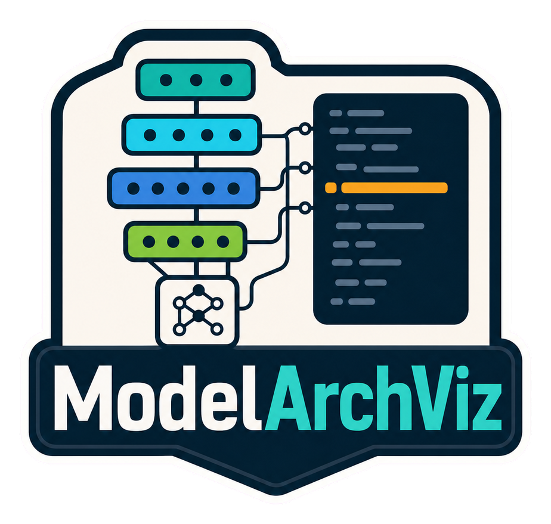

<div align="center">
  

  **🧭 Explore model architectures beside the code that defines them 🧭**
</div>

ModelArchViz is a Next.js app for inspecting neural network architecture examples alongside PyTorch/JAX code and source-paper context.

Use it to switch between embedded model specs, expand architecture blocks, select layers, and see the matching code lines highlighted in the editor.

## Install

```bash
git clone https://github.com/tsilva/modelarchviz.git
cd modelarchviz
pnpm install
pnpm dev
```

Open the local URL printed by the development server.

## Commands

```bash
pnpm generate:model-artifacts  # generate the UI source map, Colab notebooks, and PDF worker
pnpm dev                       # generate artifacts and start Next.js on an available local port
pnpm build                     # generate artifacts and build the production app
pnpm start                     # serve the production build after pnpm build
pnpm typecheck                 # generate artifacts and run TypeScript checks
```

## Optional chat

The chat pane uses the server-side OpenRouter API route. Set `OPENROUTER_API_KEY` to enable it. The optional `OPENROUTER_MODEL`, `OPENROUTER_APP_URL`, and `OPENROUTER_APP_NAME` variables override the default model and request attribution.

## Notes

- Model identity, route, paper, and source metadata live in `app/model-routes.ts`; architecture nodes and code highlights live in `app/model-arch-viz-app.tsx`. The optional chat pane uses `app/api/chat/route.ts`.
- Canonical model source files live in `app/model-notebooks` as Jupytext-style `py:percent` notebooks.
- `pnpm generate:model-artifacts` writes cleaned Python sources into `app/generated/model-sources.ts`, Colab notebooks to `public/notebooks`, and the pinned PDF.js worker to `public/pdf.worker.min.mjs`.
- `# %% [notebook-only]` cells are included in generated notebooks for examples and smoke tests, but excluded from generated site preview code.
- The code pane reads the generated source map; edit the canonical notebook sources instead of editing generated artifacts directly.
- Colab buttons use `NEXT_PUBLIC_GITHUB_REPOSITORY` and `NEXT_PUBLIC_GITHUB_BRANCH` when set. They default to `tsilva/modelarchviz` and `main`.
- Current examples range from MLPs and recurrent/Seq2Seq models through classic CNNs, Inception, ResNet, U-Net, BERT, GPT-2, and ViT.
- Paper panes render the checked-in PDFs under `public/papers`.
- No database, server-side storage, or user-data persistence is configured. Google Analytics and Sentry provide analytics, error monitoring, tracing, and replay.
- `NEXT_PUBLIC_SITE_URL` is optional and sets the absolute base URL for social metadata, sitemap, and robots output. It falls back to `https://modelarch.tsilva.eu`.
- Authoring brand assets live under `assets/brand`, runtime web and SEO assets live under `public/brand/web-seo`, and the root `logo.png` is used for repository and README display.

## License

No license file is present in this repository yet.
