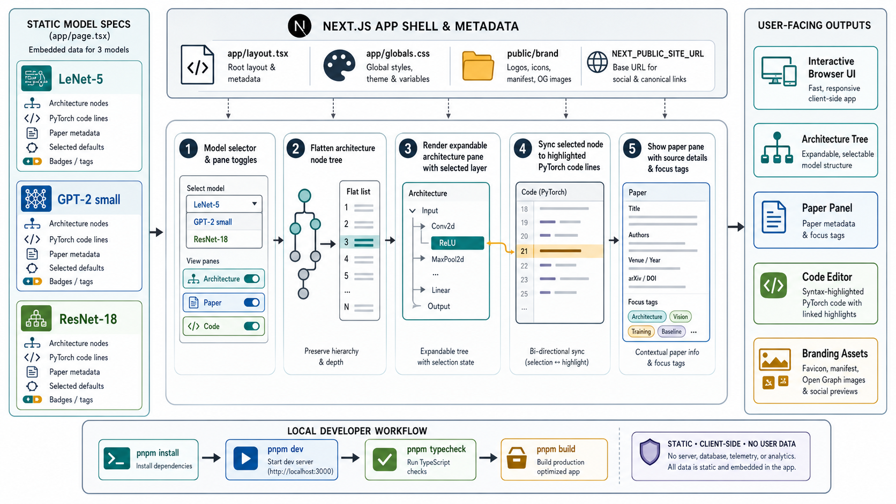

<div align="center">
  

  **🧭 Explore model architectures beside the code that defines them 🧭**
</div>

ModelArchViz is a Next.js app for inspecting neural network architecture examples alongside PyTorch code and source-paper context.

Use it to switch between embedded model specs, expand architecture blocks, select layers, and see the matching code lines highlighted in the editor.

## Install

```bash
git clone https://github.com/tsilva/modelarchviz.git
cd modelarchviz
pnpm install
pnpm dev
```

Open [http://localhost:3000](http://localhost:3000).

## Commands

```bash
pnpm dev        # start the local Next.js dev server
pnpm build      # build the production app
pnpm start      # serve the production build after pnpm build
pnpm typecheck  # run TypeScript checks
```

## Notes

- The app is client-side and uses static model data embedded in `app/page.tsx`.
- Current examples range from MLPs and recurrent models through classic CNNs, Inception, ResNet, U-Net, BERT, GPT-2, and ViT.
- Paper links point to external sources from the embedded model metadata.
- No database, server-side storage, telemetry, or user-data persistence is configured.
- `NEXT_PUBLIC_SITE_URL` is optional and only sets the absolute base URL for social metadata. It falls back to `http://localhost:3000`.
- Branding assets live under `public/brand`; the root `logo.png` is used for repository and README display.

## Architecture



## License

No license file is present in this repository yet.
